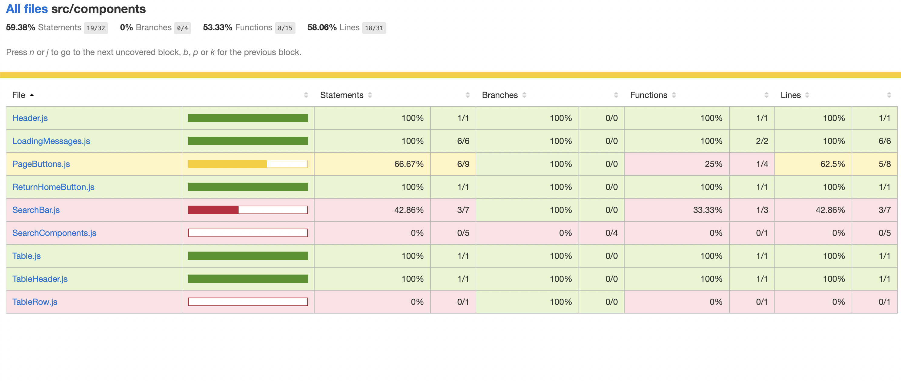

# Star Wars Fan React Application

> All the Star Wars data from:[**Here**](https://swapi.dev/)


## Introduction

This is a web application for Star Wars fans that allows them to search for and learn more about their favorite characters from the films. All the Star Wars data in this project include: Planets, Spaceships, Vehicles, People, Films and Species based on all SEVEN Star Wars films. 


## Scenarios

- When a user visits the home page, they will see a table of Star Wars characters with information such as their name, birthdate, height, weight (lb), planet, species, movie, vehicles, and starships.

- To learn more about the characters, the user can go to the previous, next, or specific page number.

- The page number shown above the table header provides the user with the current page number.

- The user types a character's name into the search box to find out more about that character in the movie.

- While waiting for a search result or a website to load, the user might glimpse iconic lines from the film.

- After searching a result, the user clicks the 'Return Home' button to return to the home page.


## Requirements

- You have a basic understanding of the Star Wars films and characters. If you don't, that's great! That's the point of this web app!

- Welcoming you aboard to explore and have a good time!


## Technologies 

- Using Bootstrap 4 for styling.

- Using React Hooks including useState & useEffect.

- Using Postman to verify the interfaces and responses.

- API calls to swapi.dev to get up to date information.

- Using the Axios library.

- Using Jest test runner to access the DOM via jsdom.

- Using webpack module bundler.

- Deploy on Heroku.


## Installation & Test

Step 1: Clone the repo.

```git clone https://github.com/junejune1/Star-Wars-Fan```

Step 2: Install node module dependencies.

```npm install```

Step 3: Run the project.

```npm start```

Step 4: Test.

```npm run test```

Step 5: Test with coverage report.

```npm run test -- --coverage --watchAll=false```




## Maintains & Further Integration

Testing Part: 

- More test coverage and test cases will be added.

Functional Part: 

- Currently, the first element from the return array is displayed in the species, films, vehicles, and starships columns. We'll traverse all array elements and display them in the next integration.

- The table columns are currently fixed. The user can configure and determine which content and how many columns will be displayed on the table in the future integration. For example, if a user only needs to know the character's name, weight, height, and cars, he or she may simply pick these columns from the table's dropdown menu or settings, and the table will only show the columns that the user selected. Later on, the user can add new columns or edit the columns.

- Currently, the user can only utilize the search bar to look for a character's name. Planets, creatures, films, cars, and starships can all be searched later.

- Currently, the website's focus is primarily on characters. After that, the user can choose from a variety of viewpoints, including planets, creatures, films, vehicles, and starships.

UI/UX Part: 

- More intriguing and significant aspects might be added to the webpage.


## Troubleshooting

If you can not run successfully, please check out the dependencies.


## FAQ

- What is the purpose of the application?

For Star Wars enthusiasts who want to learn more about the films in the franchise.

- What would be the limitations for accessing?

Right now, there are no restrictions.
